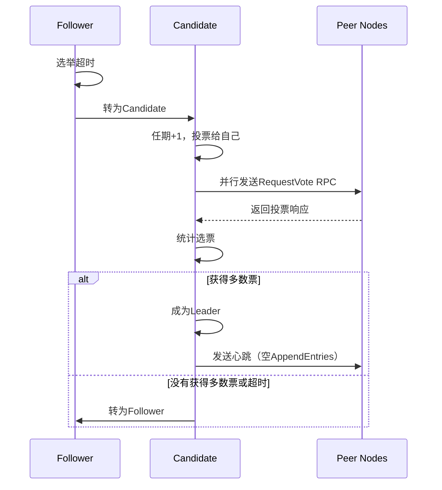

# Raft Leader选举实现文档

## 概述

本文档详细描述了Raft共识算法中Leader选举机制的实现。Leader选举是Raft算法的核心组件之一，用于在分布式系统中选出一个Leader节点来协调所有操作。

## 核心概念

### 节点状态

Raft中的每个节点都有三种可能的状态：

1. **Follower（跟随者）**：被动接收来自Leader的指令
2. **Candidate（候选者）**：参与Leader选举过程
3. **Leader（领导者）**：处理客户端请求，管理日志复制

### 任期（Term）

任期是Raft算法中的逻辑时钟：
- 每次选举开始时，任期号递增
- 用于检测过期的Leader
- 节点总是接受更高任期的请求

## Leader选举机制

### 选举触发条件

Leader选举在以下情况下触发：
1. 节点启动时（没有Leader）
2. Follower在选举超时时间内没有收到Leader的心跳
3. Candidate在选举超时时间内没有收到多数票

### 选举过程



### 实现细节

#### 1. 选举超时机制

```csharp
private async Task ElectionTimeoutLoop()
{
    while (!_cancellationTokenSource.Token.IsCancellationRequested)
    {
        var electionTimeout = GetElectionTimeout(); // 150-300ms随机
        await Task.Delay(electionTimeout, _cancellationTokenSource.Token);

        lock (_stateLock)
        {
            if (_state != RaftNodeState.Leader &&
                DateTime.UtcNow - _lastHeartbeat > TimeSpan.FromMilliseconds(electionTimeout))
            {
                _ = Task.Run(StartElection, _cancellationTokenSource.Token);
            }
        }
    }
}
```

**设计要点：**
- 使用随机超时时间（150-300ms）避免选举冲突
- 只有非Leader节点才会触发选举
- 收到心跳后重置超时计时器

#### 2. 选举启动

```csharp
private async Task StartElection()
{
    // 1. 转为Candidate状态
    lock (_stateLock)
    {
        _state = RaftNodeState.Candidate;
        _currentTerm++;           // 任期递增
        _votedFor = NodeId;       // 给自己投票
        _lastHeartbeat = DateTime.UtcNow;
    }

    // 2. 向所有对等节点请求投票
    var voteRequest = new VoteRequest
    {
        Term = currentTerm,
        CandidateId = NodeId,
        LastLogIndex = lastLogIndex,
        LastLogTerm = lastLogTerm
    };

    // 3. 并行发送投票请求
    var voteTasks = new List<Task<VoteResponse>>();
    foreach (var peerId in _peers)
    {
        if (_peerNodes.TryGetValue(peerId, out var peerNode))
        {
            var voteTask = RequestVoteFromPeerAsync(peerNode, voteRequest);
            voteTasks.Add(voteTask);
        }
    }

    // 4. 等待投票结果
    var votes = 1; // 自己的票
    var majorityVotes = (_peers.Count + 1) / 2 + 1;
    
    // 使用Task.WhenAny处理并发响应
    while (voteTasks.Count > 0 && votes < majorityVotes)
    {
        var completedTask = await Task.WhenAny(voteTasks);
        var response = await completedTask;
        
        if (response.VoteGranted)
        {
            votes++;
        }
        
        if (votes >= majorityVotes)
        {
            await BecomeLeader();
            return;
        }
    }
}
```

#### 3. 投票处理

```csharp
public async Task<VoteResponse> RequestVoteAsync(VoteRequest request, CancellationToken cancellationToken = default)
{
    lock (_stateLock)
    {
        // 拒绝过期任期的请求
        if (request.Term < _currentTerm)
        {
            return new VoteResponse { Term = _currentTerm, VoteGranted = false };
        }

        // 更新任期（如果请求任期更高）
        if (request.Term > _currentTerm)
        {
            _currentTerm = request.Term;
            _votedFor = null;
            _state = RaftNodeState.Follower;
        }

        // 投票条件：
        // 1. 还没有投票 OR 已经投票给同一个候选人
        // 2. 候选人的日志至少和自己一样新
        bool canVote = _votedFor == null || _votedFor == request.CandidateId;
        bool logUpToDate = IsLogUpToDate(request.LastLogIndex, request.LastLogTerm);

        if (canVote && logUpToDate)
        {
            _votedFor = request.CandidateId;
            _lastHeartbeat = DateTime.UtcNow; // 重置选举超时
            return new VoteResponse { Term = _currentTerm, VoteGranted = true };
        }
        else
        {
            return new VoteResponse { Term = _currentTerm, VoteGranted = false };
        }
    }
}
```

#### 4. Leader确立

```csharp
private async Task BecomeLeader()
{
    lock (_stateLock)
    {
        _state = RaftNodeState.Leader;
        _lastHeartbeat = DateTime.UtcNow;

        // 初始化Leader状态
        _nextIndex.Clear();
        _matchIndex.Clear();
        
        var nextIndex = _log.Count > 0 ? _log.Last().Index + 1 : 1;
        foreach (var peerId in _peers)
        {
            _nextIndex[peerId] = nextIndex;
            _matchIndex[peerId] = 0;
        }
    }

    // 启动心跳任务
    _heartbeatTask = Task.Run(SendHeartbeats, _cancellationTokenSource.Token);
}
```

#### 5. 心跳机制

```csharp
private async Task SendHeartbeats()
{
    while (!_cancellationTokenSource.Token.IsCancellationRequested && IsLeader)
    {
        var heartbeatTasks = new List<Task>();

        foreach (var peerId in _peers)
        {
            if (_peerNodes.TryGetValue(peerId, out var peerNode))
            {
                var heartbeatTask = SendHeartbeatToPeerAsync(peerNode);
                heartbeatTasks.Add(heartbeatTask);
            }
        }

        await Task.WhenAll(heartbeatTasks);
        await Task.Delay(50, _cancellationTokenSource.Token); // 50ms心跳间隔
    }
}
```

## 安全性保证

### 1. 选举安全性（Election Safety）
- 在任何给定任期内，最多只能选出一个Leader
- 通过要求多数票来保证

### 2. Leader完整性（Leader Completeness）
- 如果一个日志条目在给定任期内被提交，那么这个条目将出现在更高任期的所有Leader的日志中
- 通过日志新旧比较来保证

### 3. 状态机安全性（State Machine Safety）
- 如果一个服务器已经将给定索引的日志条目应用到状态机，那么其他服务器不会在同一索引应用不同的日志条目

## 容错处理

### 网络分区
- 少数派无法选出Leader（需要多数票）
- 多数派可以继续工作
- 网络恢复后自动同步

### 节点故障
- Leader故障：Followers检测到心跳超时，开始新选举
- Follower故障：不影响Leader，故障恢复后自动同步

### 脑裂预防
- 要求多数票才能成为Leader
- 任期机制防止过期Leader继续工作

## 性能优化

### 1. 并发投票请求
- 使用`Task.WhenAny`并行处理投票响应
- 一旦获得多数票立即成为Leader

### 2. 快速心跳
- 50ms心跳间隔，远小于选举超时时间
- 减少不必要的选举

### 3. 随机选举超时
- 150-300ms随机范围
- 减少选举冲突概率

## 测试验证

实现包含以下测试场景：

1. **单节点测试**：验证单节点自动成为Leader
2. **多节点选举**：验证多节点集群选出唯一Leader
3. **投票机制**：验证各种投票场景的正确处理
4. **任期管理**：验证任期更新和状态转换
5. **心跳处理**：验证心跳接收和Leader检测

## 使用方法

### 运行测试

```powershell
# 运行所有Leader选举测试
./test-leader-election.ps1

# 或者直接运行单元测试
dotnet test src/Raft.Tests/Raft.Tests.csproj
```

### 创建节点集群

```csharp
// 创建三节点集群
var node1 = new RaftNode("node1", new List<string> { "node2", "node3" }, logger);
var node2 = new RaftNode("node2", new List<string> { "node1", "node3" }, logger);
var node3 = new RaftNode("node3", new List<string> { "node1", "node2" }, logger);

// 设置节点间通信
var peerNodes = new Dictionary<string, IRaftNode>
{
    { "node1", node1 },
    { "node2", node2 },
    { "node3", node3 }
};

foreach (var node in new[] { node1, node2, node3 })
{
    var peers = peerNodes.Where(kv => kv.Key != node.NodeId)
                         .ToDictionary(kv => kv.Key, kv => kv.Value);
    node.SetPeerNodes(peers);
}

// 启动集群
await Task.WhenAll(node1.StartAsync(), node2.StartAsync(), node3.StartAsync());
```

## 总结

本实现提供了完整的Raft Leader选举机制，包括：

- ✅ 完整的选举流程
- ✅ 任期管理和状态转换
- ✅ 投票处理和验证
- ✅ 心跳机制
- ✅ 容错和安全性保证
- ✅ 并发优化
- ✅ 全面的测试覆盖

该实现遵循Raft论文的算法规范，确保了分布式系统中Leader选举的正确性和高可用性。 